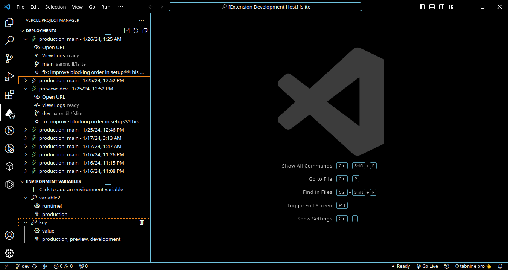

# Vercel Project Manager

Manage Vercel projects from the comfort of VSCode

Available on the [VSCode Marketplace](https://marketplace.visualstudio.com/items?itemName=AaronDill.vercel-project-manager-vscode)!

### Important note:

The CLI commands require the [Vercel CLI](https://vercel.com/docs/cli) to be installed. You can still use this extension without it, however generally, this CLI creates the `.vercel/project.json` required for this extension to detect the current project.
Without the Vercel CLI installed **globally** (install with `npm i -g vercel`) the following commands will not work:

- Run a development server through Vercel
- Link current workspace to a Vercel project
- Deploy working directory to Vercel

## Features

- Manage deployments in the activity panel
- Add, edit, and remove environment variables without ever leaving VSCode!

## Setup

This extension will automatically detect any project with a .vercel/project.json file in it and use the project id defined in that file. If you are unsure of where that file comes from, check out the [Vercel CLI](https://vercel.com/docs/cli).
If you already have the Vercel CLI installed, run `vercel link` in your terminal or use the button on the side panel to connect to a Vercel project.

1. Go to your [Vercel tokens page](https://vercel.com/account/tokens) and sign in
2. Press `Create`
3. Type a name into `TOKEN NAME`
4. Select a scope. (Note: This extension will only work with scopes for which permission is granted. Attempting to use it on a disallowed scope will likely return many errors. To avoid this, selecting `full account` is recommended, but not required)
5. Select an expiration date. Selecting `no expiration` will result in the least maintenance, however, selecting a date simply means you will have to generate a new token after that date to continue using this extension
6. Press `Create Token`
7. **Copy the code!** This is very important, because if you close it without copying, you have to regenerate a new token.
8. Open VSCode and navigate to settings

- If using settings.json, add `
"vercel.AccessToken": "<YOUR-TOKEN-GOES-HERE>",`

- if using the settings UI, search for `@ext:aarondill.vercel-project-manager-vscode` and input your token under `Vercel: Access Token`

  ### _You may have to reload VSCode for the changes to take effect_

9. Enjoy!

## Extension Settings

This extension contributes the following settings:

- `vercel.AccessToken`: Your Vercel Access Token(found at https://vercel.com/account/tokens).
- `vercel.RefreshRate`: Number of minutes to wait between refreshes of Deployments and Environment. (Default 5 minutes)
- `vercel.DeploymentCount`: Number of deployments to display from Vercel. (Default 20)

## Contributing

- Run `npm run compile` to compile your changes into the `dist` directory
- Run `npm run watch` to compile your changes and recompile when a file changes.
- Run `npm run lint` to lint the src directory for typos and errors and fix them if possible.
- Run `npm run package` to compile the extension in a production environment
- Run `npm run ext:package` to package the extension into a `*.vsix` file to be installed with `code --install-extension "<FILE>"` (vsce is required to be installed for this!)
